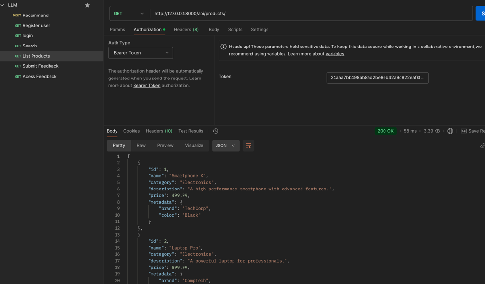

# LLM Recommendation System

This project is a recommendation system built with Django and Django REST framework. It allows users to register, login, receive product recommendations, search products, and submit feedback for products. The system uses a `.env` file to manage environment variables securely.

## Prerequisites

Before running the project, ensure you have the following installed:

- Python 3.12+
- pip (Python package manager)
- Django
- Django REST framework

## Setup

Follow the steps below to get started with the project:

### 1. Clone the Repository

First, clone the repository to your local machine:

```bash
git clone https://github.com/amanpoddar375/llm-practice.git
cd llm_recommendation
```

### 2. Create a Virtual Environment

```bash
python3 -m venv .venv
```
#### i. Activate the virtual environment

on mac
```bash
source .venv/bin/activate
```
On windows
```bash
.venv\Scripts\activate
```
### 3. Install Required Packages
```bash
pip install -r requirements.txt

```
### 4. Create a .env File
 Take reference from .env.sample 

    DATABASE_NAME="<name of the database>"
    DATABASE_USER="<name of the role/user>"
    DATABASE_PASSWORD="<db password>"
    DATABASE_HOST="<default is localhost unless set otherwise>"
    DATABASE_PORT="<default is 5432 unless set otherwise>"

### 5. Run Migrations
```bash
python manage.py migrate
```
### 6. Insert Product Data (Optional)

Create a superuser:
```bash
python manage.py createsuperuser
```


Go to the Django Admin panel at http://127.0.0.1:8000/admin/ and log in using the superuser credentials.
Alternatively you can insert data using python shell





